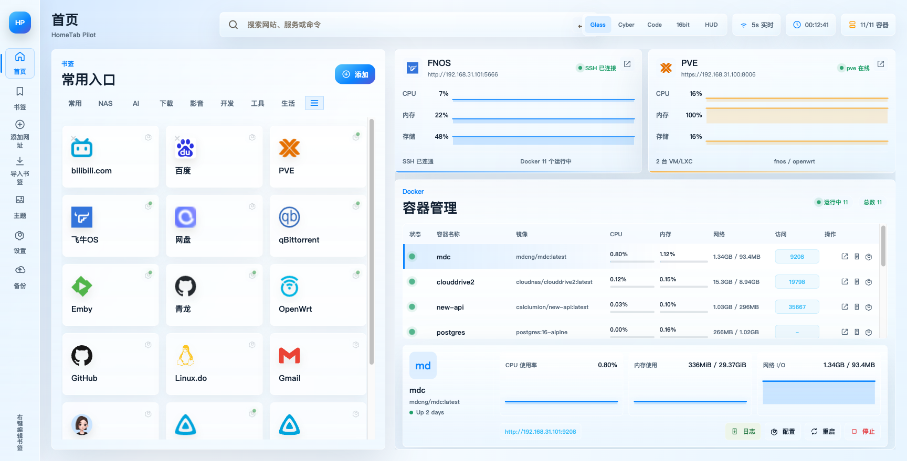
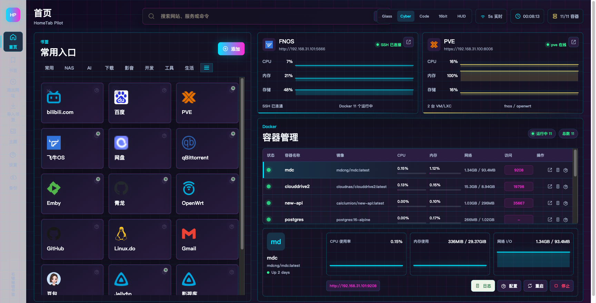
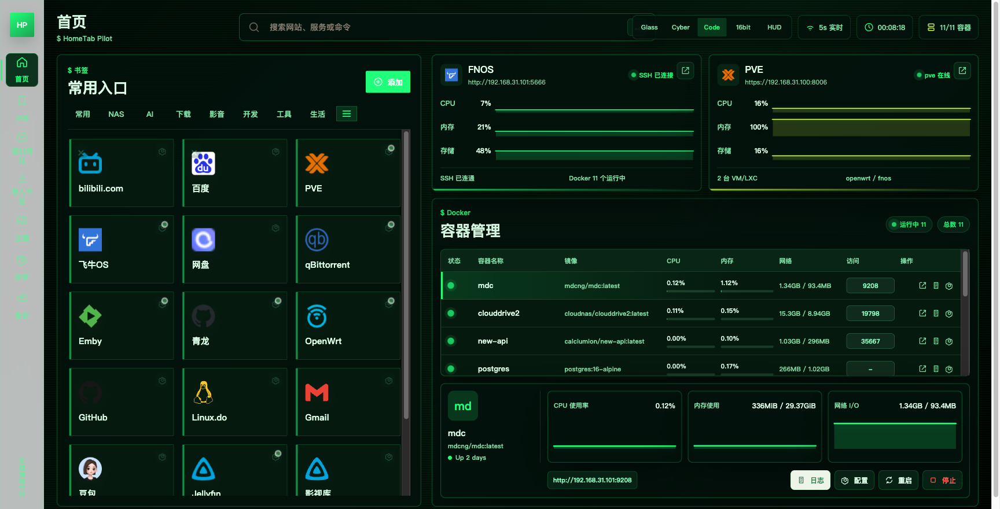
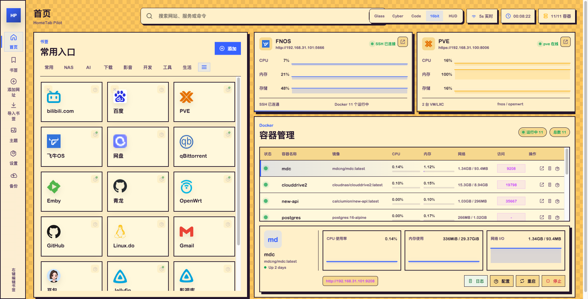
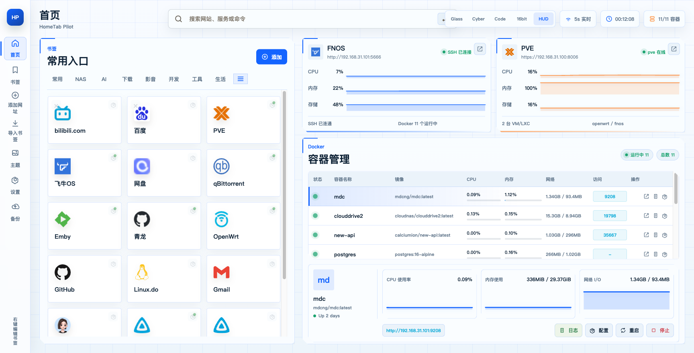
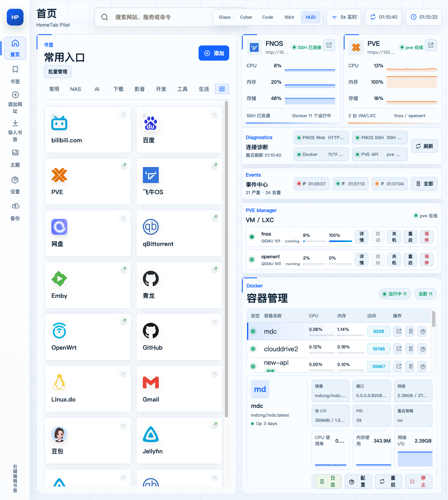
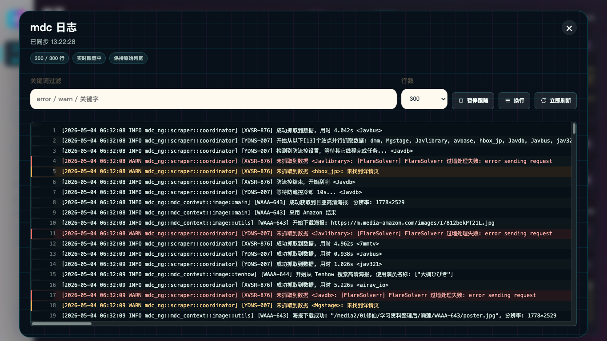
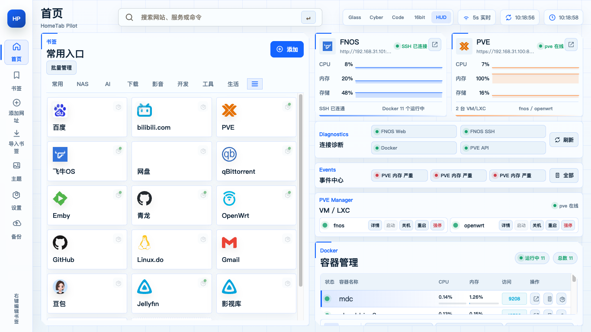

# HomeTab Pilot

HomeTab Pilot 是一个面向 NAS、Homelab 和个人服务器场景的自托管导航页。它不只是书签墙，还把飞牛 OS、PVE、Docker 容器状态、日志、资源占用和常用管理操作整合到同一个首页里，适合放在浏览器新标签页、NAS 首页、软路由首页或家庭服务器入口。

## 效果预览


| macOS 流体玻璃主题 | 赛博朋克霓虹主题 |
| --- | --- |
|  |  |

| 黑客代码终端主题 | 16 比特动画主题 |
| --- | --- |
|  |  |

| Future White HUD 主题 | Docker 容器管理 |
| --- | --- |
|  |  |

| 容器日志查看 | 书签分类与整理 |
| --- | --- |
|  |  |

## 项目特色

- 真实设备面板：通过飞牛 OS SSH、PVE API 拉取实时状态，不是静态演示数据。
- Docker 容器管理：展示容器运行状态、CPU、内存、网络、端口访问地址、日志和配置，并支持重启、停止等操作。
- PVE 实例管理：显示 QEMU / LXC 实例状态、CPU、内存，并提供启动、关机、重启、强停等快捷动作。
- 5 秒自动刷新：运行时状态定时刷新，曲线和资源占用会随真实数据更新。
- 多主题 UI：内置 macOS 流体玻璃、赛博朋克、黑客代码、16bit、HUD 等主题。
- 书签管理：支持新增、右键编辑、删除、拖拽排序、分类移动、批量导入。
- 自动 Logo：优先使用内置品牌图标、官方 favicon、Apple touch icon 和 favicon 服务。
- 备份恢复：页面内导出和导入配置，适合迁移或重装后恢复。
- 自适应布局：适配桌面、宽屏、窄屏和移动视口，避免横向溢出。
- Docker 部署：单容器运行，数据持久化到 `/data`，支持 amd64 / arm64。

## 多主题说明

HomeTab Pilot 内置 5 套完整主题，不只是替换主色，而是针对不同使用场景调整了背景质感、组件层级、卡片边框、状态标签、曲线视觉和整体氛围。

| 主题 | 风格定位 | 适合场景 |
| --- | --- | --- |
| macOS 流体玻璃 | 半透明玻璃、柔和阴影、轻量明亮 | 日常浏览器首页、NAS 家庭入口 |
| 赛博朋克霓虹 | 高对比霓虹、深色背景、强状态感 | 夜间使用、运维监控、沉浸式大屏 |
| 黑客代码终端 | 终端网格、代码感、高信息密度 | 开发者工作台、服务器状态查看 |
| 16 比特动画 | 像素边框、游戏化视觉、复古动效 | 个人玩具化首页、娱乐化 NAS 入口 |
| Future White HUD | 白色 HUD、细网格、仪表盘质感 | 长时间监控、桌面宽屏、简洁运维台 |

主题可以在顶部主题切换器中实时切换；当前选择会保存在浏览器本地，下次打开自动恢复。

## 功能总览

### 书签导航

- 分类：常用、NAS、AI、下载、影音、开发、工具、生活，可在设置中调整。
- 搜索：支持搜索站点名称或 URL，也可以直接进行网页搜索。
- 编辑：书签支持右键编辑，也可以在卡片上使用编辑按钮。
- 导入：支持 JSON 数组，或每行一个 `名称 URL` 的纯文本格式。
- 排序：支持保存书签顺序，部署模式写入数据卷。

### 飞牛 OS

- HTTP 连通检测。
- SSH 连通检测。
- CPU、内存、存储占用。
- Docker 容器列表、资源占用、端口、日志、配置。
- 容器重启、停止等操作。

### PVE

- 支持账号密码登录。
- 支持 API Token。
- 读取节点 CPU、内存、存储。
- 展示 QEMU / LXC 实例。
- 支持启动、关机、重启、强停等操作。

### 运行时与安全

- 敏感信息只放在 `.env` 或页面设置保存的数据卷中。
- 密码不会写入前端静态文件。
- 设置页不会回显已保存密码，留空代表不修改。
- 危险操作带确认流程。
- `.env`、备份、截图、构建产物默认不会进入 Git 或 Docker 镜像。

## 快速开始

### 方式一：Docker Compose

```bash
git clone https://github.com/xiaoguiwucan/hometab-pilot.git
cd hometab-pilot
cp .env.example .env
docker compose up -d
```

访问：

```text
http://服务器IP:8088
```

### 方式二：Docker Hub 镜像

镜像发布后可以直接运行：

```bash
docker run -d \
  --name hometab-pilot \
  --restart unless-stopped \
  -p 8088:8080 \
  -v hometab-data:/data \
  --env-file .env \
  xiaoguiwucan0426/hometab-pilot:latest
```

访问：

```text
http://服务器IP:8088
```

### 方式三：本地开发

```bash
npm install
npm run dev
```

访问：

```text
http://localhost:5173
```

## 环境变量

复制 `.env.example`：

```bash
cp .env.example .env
```

常用配置：

| 变量 | 说明 | 示例 |
| --- | --- | --- |
| `PORT` | 容器内服务端口 | `8080` |
| `DATA_DIR` | 持久化数据目录 | `/data` |
| `FNOS_URL` | 飞牛 OS Web 地址 | `http://192.168.1.10:5666` |
| `FNOS_SSH_HOST` | 飞牛 OS SSH 主机 | `192.168.1.10` |
| `FNOS_SSH_PORT` | 飞牛 OS SSH 端口 | `22` |
| `FNOS_SSH_USERNAME` | 飞牛 OS SSH 用户 | `user` |
| `FNOS_SSH_PASSWORD` | 飞牛 OS SSH 密码 | 留在 `.env` 中 |
| `PVE_URL` | PVE 地址 | `https://192.168.1.20:8006` |
| `PVE_USERNAME` | PVE 用户 | `root@pam` |
| `PVE_PASSWORD` | PVE 密码 | 留在 `.env` 中 |
| `PVE_TOKEN_ID` | PVE API Token ID | `root@pam!hometab` |
| `PVE_TOKEN_SECRET` | PVE API Token Secret | 留在 `.env` 中 |
| `PVE_TLS_VERIFY` | 是否校验证书 | `false` |

PVE 可以二选一：

- 使用 `PVE_USERNAME` + `PVE_PASSWORD`
- 使用 `PVE_TOKEN_ID` + `PVE_TOKEN_SECRET`

建议生产环境优先使用 PVE API Token，并给 Token 分配最小权限。

## Docker Compose 示例

```yaml
services:
  hometab:
    image: xiaoguiwucan0426/hometab-pilot:latest
    container_name: hometab-pilot
    restart: unless-stopped
    env_file:
      - .env
    ports:
      - "8088:8080"
    volumes:
      - hometab-data:/data

volumes:
  hometab-data:
```

如果你想从源码构建，把 `image` 替换为：

```yaml
build:
  context: .
  dockerfile: Dockerfile
image: hometab-pilot:latest
```

## 飞牛 OS 接入步骤

1. 确认飞牛 OS 已开启 SSH。
2. 确认用于连接的用户可以执行 Docker 命令。
3. 在 `.env` 中填写：

```bash
FNOS_URL=http://你的飞牛OS地址:端口
FNOS_SSH_HOST=你的飞牛OS地址
FNOS_SSH_PORT=22
FNOS_SSH_USERNAME=你的用户名
FNOS_SSH_PASSWORD=你的密码
```

4. 重启服务：

```bash
docker compose up -d
```

5. 打开页面右侧 Docker 面板，确认容器列表、资源占用、日志按钮可用。

## PVE 接入步骤

### 使用账号密码

```bash
PVE_URL=https://你的PVE地址:8006
PVE_USERNAME=root@pam
PVE_PASSWORD=你的密码
PVE_TLS_VERIFY=false
```

### 使用 API Token

```bash
PVE_URL=https://你的PVE地址:8006
PVE_TOKEN_ID=root@pam!hometab
PVE_TOKEN_SECRET=你的TokenSecret
PVE_TLS_VERIFY=false
```

重启服务：

```bash
docker compose up -d
```

打开页面右侧 PVE 面板，确认节点状态和 VM/LXC 列表可用。

## 数据目录

容器内 `/data` 保存运行时数据：

- 自定义书签
- 分类和排序
- 连接配置
- 备份记录
- 告警规则

推荐使用 Docker volume：

```bash
-v hometab-data:/data
```

如果希望绑定到宿主机目录：

```bash
-v /你的目录/hometab-data:/data
```

## 备份与恢复

页面左侧点击“备份”：

- 导出：下载包含配置和自定义书签的 JSON 文件。
- 导入：恢复导出的 JSON 文件。
- 服务端备份：部署模式会保存在 `/data/backups`。

迁移到新机器时：

1. 部署新容器。
2. 复制旧的 `/data` 目录，或在页面导入备份 JSON。
3. 检查 `.env` 中的连接配置。
4. 重启容器。

## 发布到 Docker Hub

本仓库内置 GitHub Actions 工作流：推送到 `main` 后自动构建并发布多架构镜像。

在 GitHub 仓库设置中添加 Actions secrets：

- `DOCKERHUB_USERNAME`
- `DOCKERHUB_TOKEN`

然后推送：

```bash
git push -u origin main
```

本地手动发布：

```bash
docker buildx build \
  --platform linux/amd64,linux/arm64 \
  -t xiaoguiwucan0426/hometab-pilot:latest \
  --push .
```

## 手动构建

```bash
npm run build
docker build -t hometab-pilot:latest .
```

多架构：

```bash
docker buildx build \
  --platform linux/amd64,linux/arm64 \
  -t yourname/hometab-pilot:latest \
  --push .
```

## 安全注意事项

- 不要把 `.env` 上传到 GitHub。
- 不要把真实密码写入 `public/config.json`。
- 不建议把服务直接暴露到公网。
- 建议通过 VPN、内网穿透鉴权层、反向代理认证或 Tailscale 访问。
- PVE 推荐使用 API Token，并限制权限。
- 飞牛 OS SSH 用户建议使用最小权限账号。
- 容器停止、重启、PVE 强停属于危险操作，请确认目标后再执行。

## 故障排查

### 页面打不开

```bash
docker ps
docker logs hometab-pilot
curl http://127.0.0.1:8088/api/health
```

### 飞牛 OS 无法连接

- 检查 `FNOS_URL` 是否能从部署机器访问。
- 检查 SSH 地址、端口、用户名、密码。
- 检查该用户是否能执行 `docker ps`。

### PVE 无法连接

- 检查 `PVE_URL` 是否包含 `https://` 和 `:8006`。
- 自签证书环境可设置 `PVE_TLS_VERIFY=false`。
- 检查账号密码或 API Token 权限。

### Docker Hub Actions 发布失败

- 检查 GitHub secrets 是否存在。
- Docker Hub Token 需要有写入权限。
- 镜像名默认为 `DOCKERHUB_USERNAME/hometab-pilot`。

## 许可证

本项目基于 [MIT License](LICENSE) 开源。
